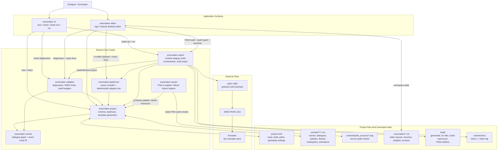
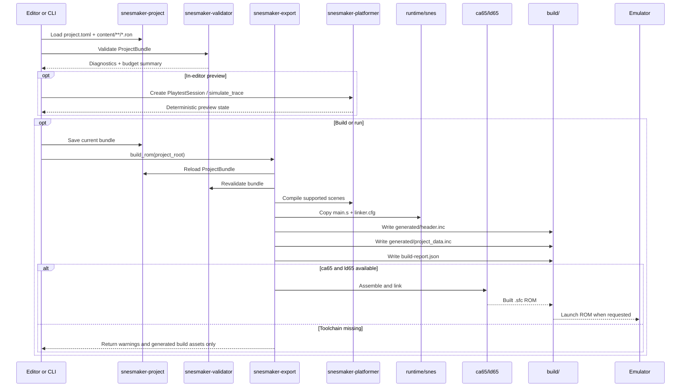

# SNES Maker Architecture

This document captures the current high-level design of the workspace based on the code in `crates/`, the shared `runtime/snes` assets, and the sample project format.

## System Architecture

## Main Runtime And Build Flow

## Notes

- `snesmaker-project` is the center of the design. Both entry points and most supporting crates work from `ProjectBundle`.
- `snesmaker-validator` is reused by the CLI, the editor, and the exporter so diagnostics stay consistent across workflows.
- `snesmaker-platformer` serves two roles today: deterministic in-editor playtesting and scene compilation for the current side-scroller runtime path.
- `snesmaker-assets` is a workspace utility crate in this snapshot. It reads PNG sprite sheets and produces `PaletteResource` / `TilesetResource`, but it is not yet on the primary CLI/editor dependency path.
